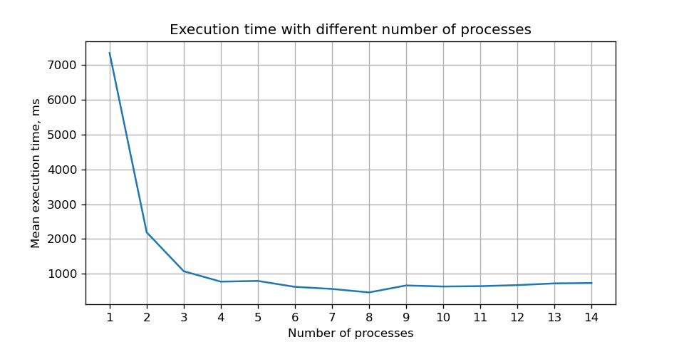

# MPI Calculating Factorial Application

## Task
1. Implement simple MPI application "mpi_factorial" in a way like you write production code (structured code with alignments, comments where needed, etc.).
2. The application calculates factorial of N (N!), N is defined as command line argument.
3. The application calculation is scaled over NP processors passed to utility mpirun:
```
$ mpirun -np <NP> mpi_factorial <N>
```
4. Each proccess instance calculates multiplication of individual 1/NP portion of factorial multipliers.
5. Root instance additianaly multiplies calculated parts from all instances and prints the final result value of N!.
6. Run the application by using:
```
$ mpirun -np 4 mpi_factorial 100
```
and
```
$ mpirun -np 1 mpi_factorial 100
```
7. Send us the application source code, mpirun results, comment about N! results got from mpiruns with different NP parameters.

## Build

Install dependencies:
```
$ sudo apt install mpich
$ sudo apt install libgmp-dev
```

Build:
```
$ mkdir build && cd build
$ cmake -DCMAKE_BUILD_TYPE=Debug $PATH_TO_SOURCES_ROOT_DIR && make
```

After build `build/bin` directory will contain two executables: `mpi_factorial` conforming Task's conditions and `tests`. The latter is used for running tests on Task's solver implementation and should be used as part of `run_tests.sh` script, which is located in build directory.

`mpi_factorial` also provides an command-line argument `--to-file`, which can be placed after factorial number to write result into a file rather than on output.

Usage example:
```
$ mpirun -np 4 mpi_factorial 1000 --to-file
```

## Results Analysis

This graph presents measurements of `mpi_factorial` program calculating `300000!` with different number of processes. Executions were conducted on laptop with: Intel(R) Core(TM) i5-8265U CPU @ 1.60GHz.



From this data it can be inferred that factorial calculation can be significantly accelerated when launched on up to 8 processes, which corresponds to number of hyper-threads on the tested device. First 4 points may be seen as contradicting the Amdahl's law, however such a speedup can be explained by a better caches locality when using more CPUs.

## Appendix

### Table representation of data from the graph.

| Number of processes | Mean execution time (ms) |
| :-----------------: | :----------------------: |
| 1 | 7350 |
| 2 | 2190 |
| 3 | 1070 |
| 4 | 770 |
| 5 | 790 |
| 6 | 620 |
| 7 | 560 |
| 8 | 460 |
| 9 | 660 |
| 10 | 630 |
| 11 | 640 |
| 12 | 670 |
| 13 | 720 |
| 14 | 730 |
